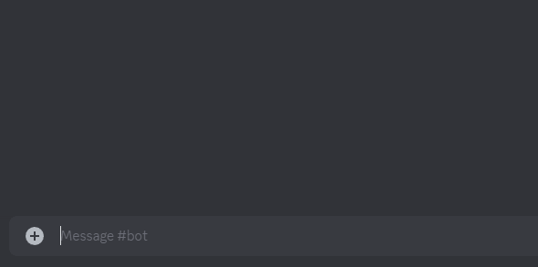

# Prompt Bot
This is an improv Discord bot that prompts "line games". Created with the intention of being used by Northeastern's "No Jokes" improv troupe Discord server.
Original bot created by [Brandon Gioggia](https://github.com/bgioggia/JokeBot/tree/master).

# Use
PromptBot uses slash commands. You can find all of the bot's commands by typing "/" and clicking on the bot's icon.
If you want to change the [random prompts](./jokes/prompts.json) PromptBot uses, you can do so by editing [this file](./jokes/prompts.json).

# Setup
If you want to run this bot on your own server, follow these steps:
1. Clone this repository (or download the source code to a .zip).
2. Create a [Discord application](https://discord.com/developers/docs/getting-started).
3. Copy the client-id, guild-id, and token to [config-example.json](./config-example.json).
4. Rename "config-example.json" to "config.json".
5. Run "npm install" to install all required node modules.
6. Run "npm .\deploy-commands.js" to deploy the slash commands to your Discord app.
7. Run "npm .\index.js" to start the app.

## Running as a Service (Windows)
If you want to run this bot continually as a [Windows Service](https://learn.microsoft.com/en-us/dotnet/framework/windows-services/introduction-to-windows-service-applications), follow these steps:
1. Ensure "node-windows" is installed as a node module.
2. Run "node .\service.js".
3. Allow all following pop-ups.
4. Ensure the service was successfully added (go to Services app and look for "Discord Bot (PromptBot)")
If you follow these steps, you should not need to run the "index.js" in the above method, however please follow all preceeding steps.